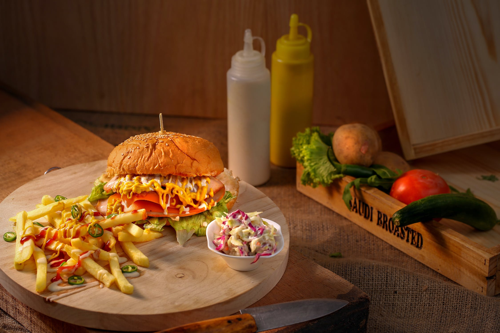
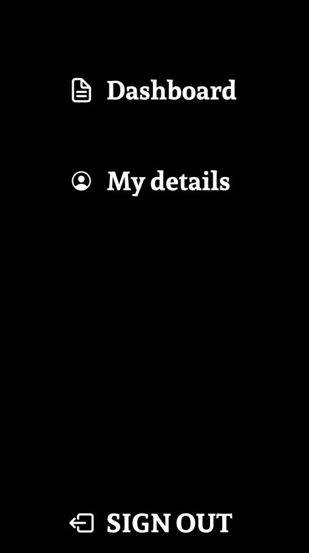
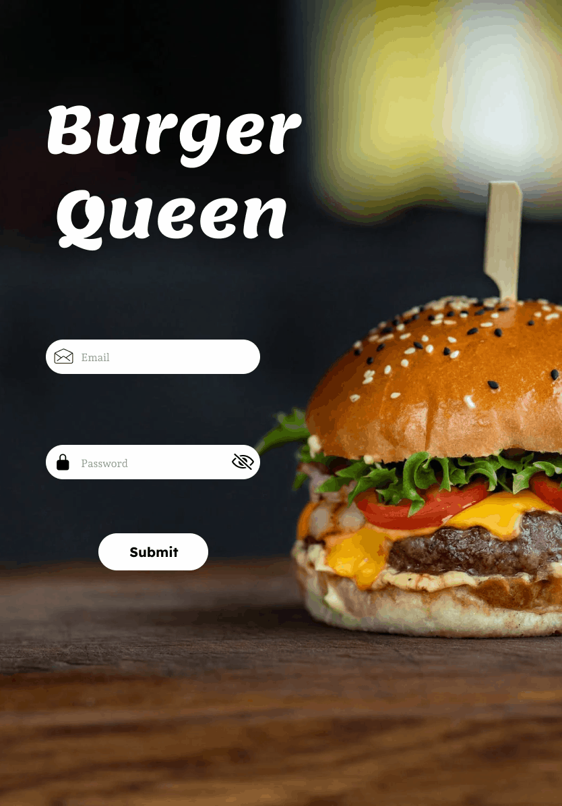

# Burger Queen Api Client

## Índice

* [1. Definición del producto](#1-definición-del-producto)
* [2. Quiénes son los principales usuarios de producto.](#2-usuarios)
* [3. Qué problema resuelve el producto / para qué le servirá a estos usuarios.?](#3-resolución-de-problemas)
* [4. Funcionalidades](#4-funcionalidades)
* [5. Historias de Usuario](#5-historias-de-usuario)
* [6. Prototipos de alta fidelidad](#6-prototipo-de-alta-fidelidad)
* [7. Planificación del Proyecto](#8-planificación-del-proyecto)

## 1. Definición del producto

El proyecto "Burger Queen API Client" es una solución tecnológica diseñada específicamente para el restaurante de hamburguesas "Burger Queen". Esta aplicación busca optimizar y agilizar el proceso de toma de pedidos y gestión de órdenes a través de la implementación de tablets en el establecimiento.

¡Espero que disfrutes de esta plataforma tanto como yo disfruté creándola!

### Características Principales:

1. **Interfaz de usuario amigable:** Con el objetivo de que cualquier miembro del personal pueda utilizarla sin dificultad, se diseñará una interfaz intuitiva y fácil de usar.
2. **Integración con la cocina:** Una vez se registre un pedido a través de la tablet, este se enviará de manera automática a la cocina, permitiendo así una preparación ordenada y eficiente.
3. **Comunicación en tiempo real:** La aplicación facilitará la comunicación entre el personal de servicio y la cocina, asegurando que cualquier cambio o ajuste en el pedido se comunique de forma inmediata.
4. **Historial de pedidos:**  La aplicación conservará un registro de todos los pedidos realizados, lo que facilitará la gestión y seguimiento en caso de requerimientos o devoluciones.
5. **Optimización de tiempos:**  Al reducir el tiempo que toma tomar y comunicar un pedido, se mejorará la experiencia del cliente al recibir su orden en un tiempo reducido.
6. **Flexibilidad y Escalabilidad:**  A medida que "Burger Queen" siga creciendo, la aplicación podrá adaptarse para satisfacer las necesidades cambiantes del restaurante, ya sea agregando más funciones o escalando para manejar un mayor volumen de pedidos.

## 2. Quiénes son los principales usuarios de producto.

* ***Personal de Servicio (Meseros y Meseras):*** Son quienes interactuarán directamente con la aplicación para tomar pedidos de los clientes. Utilizarán la tablet para registrar cada pedido, modificarlo si es necesario y enviarlo a la cocina.

* ***Personal de Cocina (Chefs y Ayudantes de Cocina):*** Aunque no estarán tomando los pedidos directamente, recibirán las órdenes enviadas a través de la aplicación. Esta comunicación les permitirá saber qué preparar, en qué orden y si hay alguna modificación o requerimiento especial.

* ***Gerente o Supervisor del Restaurante:***

1. **Gestión de Usuarios:**
* __Crear Usuarios:__ Podrá agregar nuevos usuarios al sistema, asignándoles roles específicos (mesero, chef, administrador) y proporcionándoles credenciales de acceso.
* __Actualizar Usuarios:__ Si un empleado cambia de rol o necesita actualizar su información (por ejemplo, cambio de contraseña), el gerente o supervisor tendrá la capacidad de realizar estos cambios.
* __Eliminar Usuarios:__ En caso de que un empleado deje de trabajar en el restaurante o por razones de seguridad, el gerente o supervisor puede eliminar el usuario para que ya no tenga acceso al sistema.

2. **Gestión de Productos:**
* __Agregar Productos:__ Si el restaurante introduce un nuevo platillo o bebida, el gerente o supervisor podrá añadirlo a la lista de productos disponibles en la aplicación, incluyendo detalles como precio, tipo de comida y fotografía.
* __Editar Productos:__ Los detalles de un producto (como el precio o las imagenes) pueden cambiar. El gerente o supervisor tendrá la facultad de realizar estas ediciones en el sistema.
* __Eliminar Productos:__ Si un producto ya no está disponible o se ha decidido retirarlo del menú, el gerente o supervisor podrá eliminarlo de la lista en la aplicación.

## 3. Qué problema resuelve el producto / para qué le servirá a estos usuarios?

1. Eficiencia en la Toma de Pedidos:

* __Problema:__ La toma manual de pedidos, especialmente en papel, puede ser propensa a errores, olvidos o malentendidos.
* __Solución:__ La aplicación permite una toma de pedidos rápida y precisa mediante tablets.
* __Beneficio para los Usuarios:__ El personal de servicio puede atender a más clientes en menos tiempo, reduciendo errores y aumentando la satisfacción del cliente.

2. Comunicación Optimizada con la Cocina:

* __Problema:__ La transmisión manual de pedidos a la cocina puede llevar a retrasos y confusiones.
* __Solución:__ La aplicación envía automáticamente los pedidos a la cocina, garantizando que sean atendidos en orden y según las especificaciones.
* __Beneficio para los Usuarios:__ El personal de cocina recibe instrucciones claras y organizadas, lo que facilita su trabajo y reduce el tiempo de espera para el cliente.

3. Gestión Centralizada de la Información:

* __Problema:__ Con el crecimiento del restaurante, la gestión de productos, precios y usuarios puede volverse caótica.
* __Solución:__ La aplicación ofrece herramientas de administración donde el gerente o supervisor puede gestionar productos y usuarios.
* __Beneficio para los Usuarios:__ El gerente o supervisor tiene un control completo sobre la oferta del restaurante y el acceso de los empleados, lo que facilita la toma de decisiones y garantiza la seguridad.

4. Registro y Control de Pedidos:

* __Problema:__ Sin un registro adecuado, es difícil manejar devoluciones, quejas o incluso evaluar el desempeño del restaurante.
* __Solución:__ La aplicación mantiene un historial detallado de todos los pedidos.
* __Beneficio para los Usuarios:__ Tanto el personal de atención al cliente como el gerente o supervisor pueden acceder rápidamente a la información sobre pedidos pasados para resolver problemas o tomar decisiones informadas.

5. Flexibilidad y Escalabilidad:

* __Problema:__ Con el crecimiento, las necesidades del restaurante pueden cambiar.
* __Solución:__ La aplicación está diseñada para ser adaptable, permitiendo la incorporación de nuevas funciones según las necesidades del restaurante.
* __Beneficio para los Usuarios:__ El restaurante no queda limitado por una solución estática y puede seguir evolucionando sin necesidad de cambiar constantemente de sistema.

En resumen, "Burger Queen API Client" sirve para optimizar la operación del restaurante, reducir errores, mejorar la comunicación entre el personal y ofrecer una mejor experiencia al cliente. Además, proporciona herramientas valiosas para la administración y toma de decisiones del restaurante.

## 4. Funcionalidades

1. Acceso al Sistema:

* Pantalla de login para ingresar al sistema.
* Validación de credenciales con mensajes de error claros.

2. Toma de Pedidos:

* Registro del nombre del cliente.
* Agregar productos al pedido de un cliente.
* Opción para eliminar productos del pedido.
* Resumen del pedido con total de la compra.
* Envío del pedido a la cocina y almacenamiento en la base de datos.

3. Visualización de Pedidos en la Cocina:

* Lista de pedidos ordenados según su realización.
* Opción para marcar pedidos como preparados/listos.
* Cronometraje del tiempo que toma preparar un pedido.

4. Pedidos Listos para Servir:

* Visualización de pedidos preparados/listos para ser servidos.
* Opción para marcar pedidos como entregados.

5. Administración de Trabajadores:

* Visualización de la lista de trabajadores.
* Opciones para agregar, eliminar y actualizar datos de trabajadores.

6. Administración de Productos:

* Visualización de la lista de productos.
* Opciones para agregar, eliminar y actualizar datos de productos.

### Guía de Uso de la Aplicación "Burger Queen API Client"

Comienza tu experiencia accediendo a la aplicación [aquí](https://moonlit-pasca-e1a4fa.netlify.app)

|Waiter                   |Chef                   |Admin                  |
|-------------------------|-----------------------|-----------------------|
|email: waiter@gmail.com  |email: chef@gmail.com  |email: admin@gmail.com |
|contraseña: 123456       |contraseña: 123456     |contraseña: 123456     |

La aplicación cuenta con tres vistas principales según el rol del usuario: **Administrador (Admin)**, **Mesero (Waiter)** y **Chef**. Cada vista está diseñada para satisfacer las necesidades específicas de cada rol. A continuación, se describe cómo usar cada una de estas vistas:

### 1. Vista de Administrador (Admin)
Al ingresar, el administrador se encontrará con dos pestañas o tabs principales: "Usuarios" y "Productos".

### Usuarios
Al hacer clic:
- Se muestra una tabla con las columnas:
  - Email
  - Rol (admin, chef, waiter)
  - Acciones: Al hacer clic en los tres puntos verticales, se despliegan las opciones "Editar" y "Eliminar".

### Productos
Al hacer clic:
- Se muestra una tabla con las columnas:
  - Nombre del producto
  - Tipo (desayunos, almuerzos y cenas, bebidas)
  - Precio
  - Acciones: Al hacer clic en los tres puntos verticales, se despliegan las opciones "Editar" y "Eliminar".

En el header, hay un icono de login. Al hacer clic, se desplegará la opción "Sign Out".

### 2. Vista de Mesero (Waiter)
Al ingresar, el mesero verá:
- Menú en forma de cartas con:
  - Imagen del producto
  - Nombre
  - Precio
  - Botón para agregar al carrito

El carrito de pedidos, al hacer clic, muestra:
- Detalles de los productos
- Campo para ingresar nombre del cliente y número de mesa
- Opciones para sumar, restar o eliminar productos
- Botón para enviar el pedido a la cocina

**Estados del pedido:**
- Amarillo: Pending
- Verde: Ready
- Gris: Delivered

En el header, hay un icono de login. Al hacer clic, se despliegan las opciones "Menu", "Ordenes" y "Sign Out".

### 3. Vista de Chef
Al ingresar, el chef verá:
- Tabla de órdenes con:
  - Número de mesa
  - Estatus de la orden
  - Tiempos

El chef puede:
- Ver el detalle de cada orden
- Marcar órdenes como listas

Para cerrar sesión, el chef puede hacer clic en el icono de login y seleccionar "Sign Out".

---

**Consejo General:** Asegúrate de cerrar sesión al finalizar tu turno o al dejar de usar la aplicación. Esta guía proporciona un resumen de cómo interactuar con la aplicación según el rol asignado. Familiarízate con la plataforma y explora todas sus características. ¡Buena suerte con tu uso de "Burger Queen API Client"!

### Diseño de la página

- **Fondo de la Página:** Blanco.
- **Color de Letra:** Negro, para garantizar una lectura cómoda y clara contra el fondo blanco.
- **Header:** 
  - Incorpora una imagen distintiva de una hamburguesa que representa la marca y el enfoque de la aplicación.
  - El resto del header mantiene un fondo blanco para mantener un diseño cohesivo con el resto de la página.

### Tipografía utilizada

Se quizo transmitir sensaciones como frescura, naturaleza, bienestar y autenticidad, utilizando sans-serif para una apariencia moderna y fácil legibilidad.

### Iconografía

Se utilizaron algunos íconos en el proyecto, la cual fueron tomados de la siguiente página:

[Iconos](https://react-icons.github.io/react-icons/)

### Tecnologías utilizadas

Para el desarrollo de "Burger Queen API Client", se ha optado por una combinación de tecnologías modernas y librerías populares para garantizar un desarrollo eficiente y una experiencia de usuario óptima.

## Frontend:

### React con TypeScript
- **React:** Una biblioteca JavaScript para construir interfaces de usuario de forma declarativa.
- **TypeScript:** Superconjunto de JavaScript que añade tipado estático y características de programación orientada a objetos.

### NextUI
- Una biblioteca de componentes para React que proporciona una serie de componentes altamente personalizables y listos para usar, optimizando el tiempo de desarrollo y garantizando una apariencia coherente.

### Tailwind CSS
- Un marco de utilidad de CSS de bajo nivel que permite a los desarrolladores crear diseños personalizados rápidamente sin salir del HTML.

---
**Nota:** La elección de estas tecnologías y herramientas asegura un desarrollo ágil, un diseño responsivo y una experiencia de usuario mejorada. La combinación de React con TypeScript garantiza un código más seguro y mantenible a largo plazo.

### Control de versiones

Se ha utilizado Git como sistema de control de versiones para mantener un registro detallado de los cambios realizados en el proyecto.

## 5. Historias de Usuario

#### [Historia de usuario 1] Mesero/a debe poder ingresar al sistema, si el admin ya le ha asignado credenciales

Yo como mesero quiero poder ingresar al sistema de pedidos.

##### Criterios de aceptación

Lo que debe ocurrir para que se satisfagan las necesidades del usuario.

* Acceder a una pantalla de login.
* Ingresar email y contraseña.
* Recibir mensajes de error comprensibles, dependiendo de cuál es el error
  con la información ingresada.
* Ingresar al sistema de pedidos si las crendenciales son correctas.

##### Definición de terminado

Lo acordado que debe ocurrir para decir que la historia está terminada.

* Debes haber recibido _code review_ de al menos una compañera.
* Haces _test_ unitarios y, además, has testeado tu producto manualmente.
* Hiciste _tests_ de usabilidad e incorporaste el _feedback_ del usuario.
* Desplegaste tu aplicación y has etiquetado tu versión (git tag).

***

#### [Historia de usuario 2] Mesero/a debe poder tomar pedido de cliente/a

Yo como meserx quiero tomar el pedido de unx clientx para no depender de mi mala
memoria, para saber cuánto cobrar, y enviarlo a la cocina para evitar errores y
que se puedan ir preparando en orden.

##### Criterios de aceptación

Lo que debe ocurrir para que se satisfagan las necesidades del usuario

* Anotar nombre de clientx.
* Agregar productos al pedido.
* Eliminar productos.
* Ver resumen y el total de la compra.
* Enviar pedido a cocina (guardar en alguna base de datos).
* Se ve y funciona bien en una _tablet_

##### Definición de terminado

Lo acordado que debe ocurrir para decir que la historia está terminada.

* Debes haber recibido _code review_ de al menos una compañera.
* Haces _test_ unitarios y, además, has testeado tu producto manualmente.
* Hiciste _tests_ de usabilidad e incorporaste el _feedback_ del usuario.
* Desplegaste tu aplicación y has etiquetado tu versión (git tag).

***

#### [Historia de usuario 3] Jefe de cocina debe ver los pedidos

Yo como jefx de cocina quiero ver los pedidos de lxs clientxs en orden y
marcar cuáles están listos para saber qué se debe cocinar y avisar a lxs meserxs
que un pedido está listo para servirlo a un clientx.

##### Criterios de aceptación

* Ver los pedidos ordenados según se van haciendo.
* Marcar los pedidos que se han preparado y están listos para servirse.
* Ver el tiempo que tomó prepara el pedido desde que llegó hasta que se
  marcó como completado.

##### Definición de terminado

* Debes haber recibido _code review_ de al menos una compañera.
* Haces _test_ unitarios y, además, has testeado tu producto manualmente.
* Hiciste _tests_ de usabilidad e incorporaste el _feedback_ del usuario.
* Desplegaste tu aplicación y has etiquetado tu versión (git tag).

***

#### [Historia de usuario 4] Meserx debe ver pedidos listos para servir

Yo como meserx quiero ver los pedidos que están preparados para entregarlos
rápidamente a lxs clientxs que las hicieron.

##### Criterios de aceptación

* Ver listado de pedido listos para servir.
* Marcar pedidos que han sido entregados.

##### Definición de terminado

* Debes haber recibido _code review_ de al menos una compañera.
* Haces _test_ unitarios y, además, has testeado tu producto manualmente.
* Hiciste _tests_ de usabilidad e incorporaste el _feedback_ del usuario.
* Desplegaste tu aplicación y has etiquetado tu versión (git tag).
* Los datos se deben mantener íntegros, incluso después de que un pedido ha
  terminado. Todo esto para poder tener estadísticas en el futuro.

***

#### [Historia de usuario 5] Administrador(a) de tienda debe administrar a sus trabajadorxs

Yo como administrador(a) de tienda quiero gestionar a los usuarios de
la plataforma para mantener actualizado la informacion de mis trabajadorxs.

##### Criterios de aceptación

* Ver listado de trabajadorxs.
* Agregar trabajadorxs.
* Eliminar trabajadoxs.
* Actualizar datos de trabajadorxs.

##### Definición de terminado

* Debes haber recibido _code review_ de al menos una compañera.
* Haces _test_ unitarios y, además, has testeado tu producto manualmente.
* Hiciste _tests_ de usabilidad e incorporaste el _feedback_ del usuario.
* Desplegaste tu aplicación y has etiquetado tu versión (git tag).

***

#### [Historia de usuario 6] Administrador(a) de tienda debe administrar a sus productos

Yo como administrador(a) de tienda quiero gestionar los productos
para mantener actualizado el menú.

##### Criterios de aceptación

* Ver listado de productos.
* Agregar productos.
* Eliminar productos.
* Actualizar datos de productos.

##### Definición de terminado

* Debes haber recibido _code review_ de al menos una compañera.
* Haces _test_ unitarios y, además, has testeado tu producto manualmente.
* Hiciste _tests_ de usabilidad e incorporaste el _feedback_ del usuario.
* Desplegaste tu aplicación y has etiquetado tu versión (git tag).

## 6. Prototipos de alta fidelidad

* [Figma-Vista_Admin](https://www.figma.com/proto/WjhZMzkkvHQm6iGpcYGXGC/Prototipo_admin?type=design&t=iXhfb6zgO4S7UaV3-0&scaling=contain&page-id=0%3A1&starting-point-node-id=1%3A21&node-id=1-2)

* [Figma-Vista_Waiter](https://www.figma.com/proto/haeBZTJ4cSYlcwA5NWLriz/Prototipo_Mesero?type=design&node-id=1-2&t=iXhfb6zgO4S7UaV3-0&scaling=scale-down&page-id=0%3A1&starting-point-node-id=1%3A2)

* [Figma-Vista_Chef](https://www.figma.com/proto/8ngZreapyTEkVqlHffw36x/Prototipo_chef?type=design&node-id=1-2&t=iXhfb6zgO4S7UaV3-0&scaling=contain&page-id=0%3A1&starting-point-node-id=1%3A21)

## 7. Planificación del Proyecto

Una pieza central en el desarrollo efectivo y organizado de "Burger Queen API Client" ha sido una planificación meticulosa y una gestión sistemática de las tareas. Esta organización se logró gracias a la robusta herramienta de GitHub: GitHub Project.

Inicié segregando el proyecto en tareas concretas, dándome así una visión detallada de cada componente y de las fases necesarias para su realización. Todas estas tareas se ubicaban inicialmente bajo la columna "Todo". Esta columna actuaba como un contenedor de todos los pendientes, delineando claramente lo que estaba por venir y las prioridades inmediatas.

Al comenzar a trabajar en cada tarea, estas se desplazaban hacia la columna "In Process". Esta dinámica no solo me ofrecía una perspectiva clara del avance en tiempo real, sino que también aseguraba que no se trabajara dos veces en la misma tarea o se pasara por alto algún detalle crucial.

Una vez que cada tarea era finalizada, se movía a la columna "Done". Este cambio simbolizaba un logro dentro del proyecto y servía como un motivador constante, recordándome lo que ya se había alcanzado y cuánto más se estaba acercando a la finalización total del proyecto.

La implementación de GitHub Project en "Burger Queen API Client" fue instrumental para maximizar la eficiencia, garantizar que todos los elementos estuvieran en su lugar y llevar el proyecto a su exitosa conclusión.